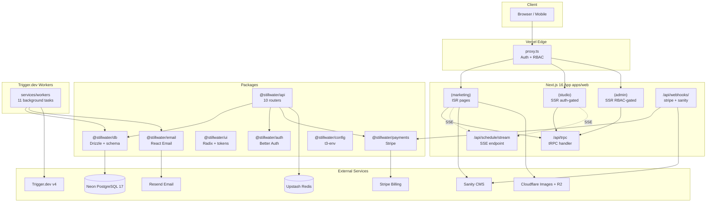
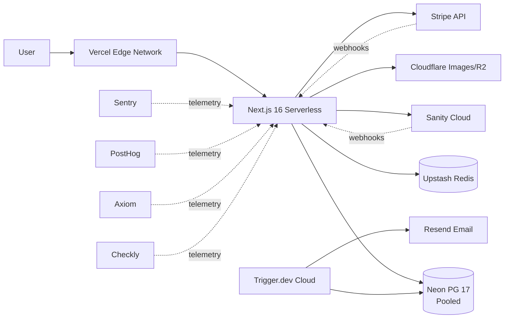

# Stillwater

[](https://nodejs.org/)
[](https://pnpm.io/)
[](https://nextjs.org/)
[](https://react.dev/)
[](https://www.typescriptlang.org/)
[](https://tailwindcss.com/)
[](https://www.postgresql.org/)
[](https://orm.drizzle.team/)
[](https://trpc.io/)
[](#license)
[](#project-status)

> **A sanctuary for mindful movement.** An enterprise-grade yoga studio management platform — public marketing surface, member booking application, RBAC-gated admin, real-time seat availability via SSE, Stripe subscription billing, and Trigger.dev v4 background jobs. Built with the calm intentionality of Japanese editorial design.

---

## Overview

Stillwater is the operational backbone and digital face of a boutique yoga studio in Southeast Portland. It serves three populations from one Turborepo monorepo: a **public audience** (schedule, instructors, pricing, blog — ISR-cached, Sanity-backed), **members** (booking, dashboard, membership management — auth-gated, real-time), and **studio operations** (RBAC-gated admin for staff/manager/owner).

The platform replaces a class of brittle brochure-site-plus-Stripe-link yoga websites with a SaaS-grade product: PostgreSQL advisory locks for double-booking prevention, idempotent Stripe webhook processing, an 11-job Trigger.dev v4 background worker for emails and waitlist promotion, and WCAG 2.2 Level AAA accessibility for the 35–65 demographic the studio serves.

The architecture is documented in three layered sources: [`PAD.md`](./PAD.md) is the canonical Project Architecture Document with 11 ADRs (all Accepted as of 2026-07-09 — ADR-010 was the last to be accepted); [`MASTER_EXECUTION_PLAN.md`](./MASTER_EXECUTION_PLAN.md) is the 13-phase TDD execution plan that reconciles 45 discrepancies between source documents; [`stillwater_SKILL.md`](./stillwater_SKILL.md) is the distilled project skill (v2.1.0) condensing 21 source skills.

---

## Key Features

| # | Feature                              | Description                                                                                            |
|---|--------------------------------------|--------------------------------------------------------------------------------------------------------|
| 🧘 | **Live class schedule**              | 7-day tab grid with real-time seat counts via Server-Sent Events                                       |
| 📅 | **Transactional booking**            | Double-booking prevented by PostgreSQL advisory locks; auto-waitlist when full                          |
| ⏳ | **Waitlist promotion**               | 2-hour offer window with cascading promotion when expired                                              |
| 💳 | **Stripe subscriptions**             | Full lifecycle: trialing → active → past_due → paused → cancelled; idempotent webhook handler           |
| 📦 | **Class credit packs**               | One-off PaymentIntent purchases for non-subscription members                                           |
| 🔐 | **Better Auth + RBAC**               | Google OAuth + Magic Link; 6 roles × 13 permissions matrix; 2-layer auth (cookie-only `proxy.ts` + Server Component layouts) |
| ✉️ | **11 background jobs**               | Trigger.dev v4 tasks for confirmations, reminders, waitlist, digest, attendance — all retried & durable |
| 📝 | **Sanity marketing CMS**             | Webhook-triggered ISR; editors publish without deploys                                                 |
| ♿ | **WCAG 2.2 Level AAA**               | 7:1 contrast, full keyboard nav, screen-reader semantics, reduced-motion respect                       |
| 🎨 | **"Editorial Calm" design system**   | Warm Mineral palette (stone/clay/water/sand), Cormorant Garamond + DM Sans + JetBrains Mono, sharp edges |
| 📊 | **Observability stack**              | Sentry errors, PostHog analytics (18 events), Axiom logs, Checkly synthetics                           |
| ⚡ | **Edge ISR + Turbopack**             | Marketing pages < 80kb gzipped; LCP < 1.5s; Lighthouse A11y = 100                                       |

---

## Architecture

### Tech Stack

| Layer            | Technology                  | Version     | Purpose                                                        |
|------------------|-----------------------------|-------------|----------------------------------------------------------------|
| Frontend         | Next.js                     | 16.2.10     | App Router, Turbopack, React Compiler, `proxy.ts`              |
| UI Library       | React                       | 19.2.7      | Server Components by default, Client Islands for interactivity |
| Styling          | Tailwind CSS                | 4.3.0       | CSS-first `@theme` directive, no `tailwind.config.js` required |
| Component Lib    | Radix UI + shadcn/ui        | latest      | Accessible primitives; never rebuild what Radix provides       |
| Language         | TypeScript                  | 5.9.0       | Strict mode + `noUncheckedIndexedAccess` + `exactOptionalPropertyTypes` + `erasableSyntaxOnly` (no `enum`/`namespace`) |
| API Layer        | tRPC                        | v11         | End-to-end type safety; server caller for RSC, React Query for client |
| ORM              | Drizzle ORM                 | 0.45.0      | Schema in TypeScript, no codegen, advisory lock support        |
| Database         | PostgreSQL                  | 17          | 17 tables (14 domain + 3 Better Auth), 8 enums, 5 critical indexes (incl. partial + unique)|
| DB Host          | Neon                        | latest      | Serverless PG with branching for preview envs                  |
| Cache / Rate Limit | Upstash Redis             | latest      | Per-procedure rate limiting on auth + booking mutations        |
| Auth             | Better Auth                 | 1.6.23      | Replaces Auth.js v5 (ADR-008); Drizzle adapter; 2-layer auth pattern |
| Background Jobs  | Trigger.dev                 | v4 platform | 11 durable tasks; SDK import is `@trigger.dev/sdk` (root import — v4 SDK; NEVER `/v3` deprecated, NEVER `/v4` which doesn't exist) |
| Monorepo         | Turborepo                   | 2.10.0      | Task graph + remote caching                                     |
| Package Manager  | pnpm                        | 11.9.0      | Workspace protocol; `customConditions` for source linking; v9 is EOL |
| CMS              | Sanity                      | v3          | Marketing content only (ADR-005); hosted at stillwater.sanity.studio (Q4) |
| Payments         | Stripe                      | 22.3.0      | "Dahlia" API (2026-06-24); subscriptions + credit packs + idempotent webhooks |
| Email Templates  | React Email                | 6.6.6       | v6 unified package (April 2026); 13 templates, single-column 600px, CAN-SPAM |
| Email Delivery   | Resend                      | 6.17.1      | 2,400 emails/day free tier; Native Templates API available     |
| Linting          | ESLint                      | 9.39.4      | v9 flat config; do NOT upgrade to v10 (plugin incompatibility) |
| Observability    | Sentry + PostHog + Axiom + Checkly | latest | Errors, product analytics, structured logs, uptime synthetics  |
| Deployment       | Vercel + Neon               | latest      | Preview deploys per PR; production on `main` merge             |
| Testing          | Vitest + Playwright         | latest      | TDD mandatory; 90% coverage on `packages/api/routers/*`        |

### Architectural Principles

1. **TypeScript strict, no `any`** — use `unknown` and narrow
2. **Library discipline** — if Radix/shadcn provides a primitive, use it; never rebuild
3. **Zod at every boundary** — tRPC inputs, env vars (t3-env), webhook payloads, forms
4. **Advisory locks for concurrency** — `pg_advisory_xact_lock()` for booking (ADR-004)
5. **Idempotent webhooks** — `payment_events.stripe_event_id` UNIQUE INDEX + advisory lock
6. **Side effects in background jobs** — emails/notifications never run synchronously in API routes
7. **Editorial Calm design** — anti-generic enforcement: no purple gradients, no Inter-only, no drop shadows
8. **WCAG 2.2 Level AAA** — 7:1 contrast, full keyboard nav, reduced-motion globally respected
9. **ISR for marketing, SSR for personalised, CSR for real-time** — per-route rendering strategy (see `PAD.md` §12)
10. **Self-hosted fonts** — zero FOUT, zero third-party font CDN in production

### High-Level Architecture



---

## File Hierarchy

```
stillwater/
├── 📂 apps/
│   ├── 📂 web/                          # Next.js 16 application
│   │   ├── 📂 src/app/
│   │   │   ├── 📂 (marketing)/          # Public routes — ISR
│   │   │   ├── 📂 (studio)/             # Member routes — SSR auth-gated
│   │   │   ├── 📂 (admin)/              # Staff/Manager/Owner routes — SSR RBAC
│   │   │   ├── 📂 api/                  # tRPC + webhooks + SSE
│   │   │   ├── 📄 layout.tsx            # Root layout: fonts, providers, analytics
│   │   │   └── 📄 globals.css           # Tailwind v4 @theme + token imports
│   │   ├── 📂 src/components/           # App-specific components
│   │   ├── 📂 src/lib/                  # trpc, auth, sanity, utils
│   │   ├── 📄 proxy.ts                  # Next.js 16 middleware (auth + RBAC + i18n)
│   │   ├── 📄 next.config.ts            # React Compiler + Turbopack + CSP headers
│   │   └── 📄 components.json           # shadcn/ui config
│   └── 📂 studio/                       # Sanity Studio (separate deploy)
│
├── 📂 packages/                         # Shared libraries
│   ├── 📂 ui/                           # Radix-based components + design tokens
│   ├── 📂 db/                           # Drizzle schema + migrations + seed
│   ├── 📂 api/                          # tRPC routers (10) + middleware
│   ├── 📂 auth/                         # Better Auth config + RBAC matrix
│   ├── 📂 email/                        # 13 React Email templates + Resend
│   ├── 📂 payments/                     # Stripe client + idempotent webhooks
│   └── 📂 config/                       # t3-env Zod-validated env schema
│
├── 📂 services/
│   └── 📂 workers/                      # Trigger.dev v4 background jobs (11 tasks)
│
├── 📂 tooling/                          # Shared configs
│   ├── 📂 eslint/                       # ESLint v9 flat config
│   ├── 📂 typescript/                   # base/nextjs/library presets
│   └── 📂 tailwind/                     # Tailwind v4 base tokens
│
├── 📂 infrastructure/postgres/init/     # Docker entrypoint SQL
├── 📂 .github/workflows/                # CI + deploy pipelines
├── 📄 docker-compose.yml                # Postgres 17 + Redis 7 + Adminer
├── 📄 turbo.json                        # Task graph + caching
├── 📄 pnpm-workspace.yaml               # Workspace + customConditions
├── 📄 .env.example                      # 34 env vars documented
├── 📄 PAD.md                            # Project Architecture Document (canonical)
├── 📄 MASTER_EXECUTION_PLAN.md          # 13-phase TDD execution plan
├── 📄 scaffolding_files.md              # Phase 0 ready-to-paste configs
├── 📄 design.md                         # Architecture critique + merge rationale
└── 📄 static_landing_page_html_mockup.md # Landing page spec + HTML mockup
```

---

## Quick Start

### Prerequisites

- **Node.js ≥ 22.0.0** (LTS recommended)
- **pnpm ≥ 11.0.0** (`npm install -g pnpm@11`; pnpm 9.x is EOL)
- **Docker + Docker Compose** (for local Postgres + Redis)
- **Git**

### Steps

```bash
# 1. Clone
git clone https://github.com/nordeim/stillwater.git
cd stillwater

# 2. Install dependencies (uses workspace protocol + @stillwater/source custom condition)
pnpm install

# 3. Copy environment template and fill in values
cp .env.example .env.local
# Edit .env.local — at minimum:
#   - Generate BETTER_AUTH_SECRET: openssl rand -base64 32
#   - Set Google OAuth credentials (or skip if testing magic link only)
#   - Set DATABASE_URL password to match docker-compose (stillwater_local_dev)

# 4. Start local Postgres 17 + Redis 7 + Adminer
docker compose up -d

# 5. Run database migrations (uses DATABASE_URL_UNPOOLED)
pnpm db:migrate

# 6. Seed development data (5 demo members, 3 instructors, 4 classes, 7 sessions)
pnpm db:seed

# 7. Start all apps in dev mode (Next.js on :3000, Trigger.dev worker)
pnpm dev
```

### Verify Setup

```bash
# Web app responds
curl http://localhost:3000
# Expected: 200 OK with "Stillwater" in body

# Postgres is healthy
docker compose ps postgres
# Expected: "healthy" status

# All 17 tables created (Phase 1: 14 domain + Phase 2: 3 Better Auth)
docker compose exec postgres psql -U stillwater -d stillwater_dev -c '\dt'
# Expected: 17 tables listed (users, members, instructors, class_styles, classes, rooms,
#           class_sessions, enrollments, waitlist_entries, membership_plans,
#           member_subscriptions, class_packages, payment_events, role_assignments,
#           session, account, verification)

# All 8 enums created (Phase 1)
docker compose exec postgres psql -U stillwater -d stillwater_dev -c '\dT'
# Expected: 8 enum types listed (class_level, session_status, enrollment_status, waitlist_status,
#           subscription_status, billing_interval, studio_role, payment_status)

# Seed data loaded (Phase 1)
docker compose exec postgres psql -U stillwater -d stillwater_dev -c 'SELECT count(*) FROM users;'
# Expected: 5

# Unit tests pass (499 tests, no DB needed for unit tests)
pnpm test --filter=@stillwater/db
# Expected: "Test Files  16 passed (16)" + "Tests  109 passed (109)"

# Adminer GUI available
open http://localhost:8080
# Login: server=postgres, user=stillwater, db=stillwater_dev, pass=stillwater_local_dev

# Type checking passes
pnpm check-types
# Expected: green

# Lint passes
pnpm lint
# Expected: green
```

---

## Environment Variables

All 34 env vars are documented in [`.env.example`](./.env.example) and validated via `t3-env` Zod schema in `packages/config/src/env.ts`. Critical ones grouped by purpose:

### Application
| Variable                  | Purpose                                  | Example                          |
|---------------------------|------------------------------------------|----------------------------------|
| `NODE_ENV`                | Environment                              | `development`                    |
| `NEXT_PUBLIC_APP_URL`     | Public app URL (used for OAuth callbacks)| `http://localhost:3000`          |

### Database (Neon PostgreSQL)
| Variable                    | Purpose                                                  |
|-----------------------------|----------------------------------------------------------|
| `DATABASE_URL`              | Pooled connection (Neon PgBouncer) — all app queries     |
| `DATABASE_URL_UNPOOLED`     | Direct connection — migrations + seeding only            |

### Authentication (Better Auth)
| Variable                   | Purpose                                  |
|----------------------------|------------------------------------------|
| `BETTER_AUTH_SECRET`       | Session cookie signing (min 32 chars)    |
| `BETTER_AUTH_URL`          | Auth callback base URL                   |
| `GOOGLE_CLIENT_ID`         | Google OAuth client ID                   |
| `GOOGLE_CLIENT_SECRET`     | Google OAuth client secret               |

### Stripe
| Variable                              | Purpose                          |
|---------------------------------------|----------------------------------|
| `STRIPE_SECRET_KEY`                   | Server-side Stripe API key       |
| `STRIPE_WEBHOOK_SECRET`               | Webhook signature verification   |
| `NEXT_PUBLIC_STRIPE_PUBLISHABLE_KEY`  | Client-side Stripe key           |

### Sanity CMS
| Variable                            | Purpose                                  |
|-------------------------------------|------------------------------------------|
| `NEXT_PUBLIC_SANITY_PROJECT_ID`     | Sanity project ID                        |
| `NEXT_PUBLIC_SANITY_DATASET`        | Dataset name (`production` / `development`) |
| `SANITY_API_TOKEN`                  | Server-side read token (never expose)    |
| `SANITY_WEBHOOK_SECRET`             | Webhook HMAC verification                |

### Email + Jobs + Cache
| Variable                     | Purpose                                  |
|------------------------------|------------------------------------------|
| `RESEND_API_KEY`             | Resend email delivery                    |
| `EMAIL_FROM`                 | From address (e.g. `hello@stillwater.studio`) |
| `TRIGGER_SECRET_KEY`         | Trigger.dev Cloud auth                   |
| `UPSTASH_REDIS_REST_URL`     | Redis for rate limiting + idempotency    |
| `UPSTASH_REDIS_REST_TOKEN`   | Redis auth token                         |

### Observability + Storage
| Variable                                | Purpose                          |
|-----------------------------------------|----------------------------------|
| `SENTRY_DSN` / `NEXT_PUBLIC_SENTRY_DSN` | Error tracking                   |
| `SENTRY_AUTH_TOKEN`                     | Source map uploads (CI only)     |
| `NEXT_PUBLIC_POSTHOG_KEY` / `_HOST`     | Product analytics                |
| `AXIOM_TOKEN` / `AXIOM_DATASET`         | Structured logs                  |
| `CLOUDFLARE_ACCOUNT_ID`                 | Images + R2 storage              |
| `CLOUDFLARE_R2_*`                       | R2 credentials + bucket          |
| `NEXT_PUBLIC_CLOUDFLARE_IMAGES_URL`     | Image CDN base URL               |

> **CI/CD only** (do not set locally): `VERCEL_TOKEN`, `VERCEL_ORG_ID`, `VERCEL_PROJECT_ID`, `NEON_API_KEY`, `NEON_PROJECT_ID`

---

## Testing

TDD is mandatory for all business logic (Red → Green → Refactor → Commit, one cycle per atomic commit). Pure CSS/layout changes are exempt.

### Commands

```bash
# Unit + integration tests (Vitest)
pnpm test                           # All packages
pnpm test --filter=@stillwater/api  # Single package
pnpm test:watch                     # Watch mode
pnpm test:coverage                  # With V8 coverage report

# E2E tests (Playwright)
pnpm test:e2e                       # All browsers (chromium, firefox, webkit)
pnpm test:e2e --ui                  # Interactive mode
pnpm test:e2e -- --grep "booking"   # Filter by name

# Type checking + linting
pnpm check-types                    # TypeScript across all packages
pnpm lint                           # ESLint across all packages
pnpm lint:fix                       # Auto-fix
pnpm format                         # Prettier write
pnpm format:check                   # Prettier verify
```

### Coverage Targets

| Package                          | Target | Priority Areas                                |
|----------------------------------|--------|-----------------------------------------------|
| `packages/api/routers/*`         | 90%    | Booking logic, waitlist, credit consumption   |
| `packages/payments/*`            | 95%    | Subscription state machine, webhook handlers  |
| `packages/db/schema/*`           | 80%    | Constraints, relationships                    |
| `apps/web/components/*`          | 70%    | Interaction behavior, state transitions       |
| `services/workers/*`             | 85%    | Job execution, error paths                    |

### Test Pyramid

- **~300 unit tests** — pure business logic, factory-pattern test data
- **~80 integration tests** — Vitest + Testcontainers Postgres for full transaction flows
- **~20 E2E tests** — Playwright covering critical user journeys (signup → book → waitlist → cancel)
- **Visual regression** — Playwright + Percy, weekly on UI package changes
- **A11y automated** — `@axe-core/playwright` + Lighthouse Accessibility (target: 100)

### CI Pipeline (8 gates, all must pass)

1. `pnpm turbo check-types`
2. `pnpm turbo lint`
3. `pnpm turbo test --coverage`
4. `pnpm turbo build`
5. `pnpm turbo test:e2e`
6. `pnpm lighthouse ci`
7. `pnpm bundle-size`
8. `pnpm audit --audit-level=high`

---

## API Reference

tRPC exposes 10 routers merged in `packages/api/src/root.ts`. The full type is inferred by the React client (no codegen).

| Router          | Procedures                                                                                   | Access     |
|-----------------|----------------------------------------------------------------------------------------------|------------|
| `schedule`      | `getWeek`, `getSession`                                                                      | public     |
| `classes`       | `list`, `getBySlug`, `create`, `update`, `delete`                                            | public + staff |
| `sessions`      | `listByDateRange`, `create`, `update`, `cancel`, `checkIn`                                   | public + staff |
| `bookings`      | `book` ⚠️, `cancel` ⚠️, `checkIn`                                                            | protected + staff |
| `waitlist`      | `join`, `leave`, `claimOffer`, `getMyPosition`                                               | protected  |
| `members`       | `getProfile`, `updateProfile`, `getHistory`, `list`                                          | protected + staff |
| `instructors`   | `list`, `getBySlug`, `create`, `update`                                                      | public + staff |
| `memberships`   | `getPlans`, `subscribe` ⚠️, `cancel`, `pause`, `resume`, `getMySubscription`                 | public + protected |
| `payments`      | `getPortalUrl`, `getInvoices`, `refund` ⚠️                                                   | protected + staff |
| `admin`         | `getDashboard`, `getRevenue`, `getClassRoster`, `getAttendanceStats`                         | staff + manager |

> ⚠️ = mutation with side effects (email, credit consumption, or external API call). All mutations are rate-limited via Upstash Redis.

### Other HTTP Endpoints

| Endpoint                            | Method | Purpose                                  |
|-------------------------------------|--------|------------------------------------------|
| `/api/auth/[...all]`                | GET/POST | Better Auth handler (sign-in, callback) |
| `/api/trpc/[trpc]`                  | GET/POST | tRPC HTTP batch endpoint                |
| `/api/schedule/stream?sessionId=`   | GET    | SSE for live seat availability           |
| `/api/webhooks/stripe`              | POST   | Stripe webhook (signature-verified)      |
| `/api/sanity/webhook`             | POST   | Sanity publish → `revalidatePath`        |

---

## Design System

The "Stillwater" identity follows an **Editorial Calm** direction inspired by Kinfolk magazine and Japanese *ma* (negative space as active presence).

### Color Palette — "Warm Mineral"

| Token              | Hex       | Usage                                |
|--------------------|-----------|--------------------------------------|
| `--color-stone-950`| `#0F0D0B` | Deepest shadow                       |
| `--color-stone-900`| `#1C1915` | Primary text (near-black warm)       |
| `--color-stone-400`| `#8C7B6E` | Secondary text                       |
| `--color-stone-50` | `#F5F0E8` | Page background (warm white = `--color-sand`) |
| `--color-clay-400` | `#C4856A` | Primary CTA (terracotta)             |
| `--color-clay-500` | `#9E5E44` | Hover state                          |
| `--color-water-500`| `#7B9EA8` | Accent (muted teal)                  |
| `--color-sand-warm`| `#EDE5D8` | Card surface                         |
| `--color-success`  | `#4A7C59` | Muted forest green                   |
| `--color-error`    | `#B85450` | Muted red-clay                       |

> ❌ **Banned**: purple/sage wellness palette, drop shadows, generic teal CTAs. ✅ **Required**: rule lines + whitespace as depth signals, asymmetric editorial grid breaks.

### Typography (Self-Hosted)

| Font                | Usage            | Fallback                       |
|---------------------|------------------|--------------------------------|
| Cormorant Garamond  | Display / headings | Georgia, serif               |
| DM Sans             | Body             | system-ui, sans-serif          |
| JetBrains Mono       | Data / admin     | ui-monospace, SFMono-Regular   |

Type scale uses 9 fluid `clamp()` tokens (e.g., `--text-display-2xl: clamp(3.5rem, 8vw, 7rem)`).

### Motion

| Token                  | Value                              | Usage                |
|------------------------|------------------------------------|----------------------|
| `--ease-gentle`        | `cubic-bezier(0.16, 1, 0.3, 1)`    | Snappy settle (expo out) |
| `--ease-breathe`       | `cubic-bezier(0.45, 0, 0.55, 1)`   | Organic (sine in-out)   |
| `--duration-quick`     | `150ms`                            | Hover states         |
| `--duration-standard`  | `300ms`                            | Transitions          |
| `--duration-slow`      | `600ms`                            | Page reveals         |

`prefers-reduced-motion` zeroes all durations to 0.01ms globally.

---

## Deployment

### Production Architecture



### Environments

| Environment | Branch     | Database           | URL                              |
|-------------|------------|--------------------|----------------------------------|
| development | any        | docker-compose PG  | `http://localhost:3000`          |
| preview     | PR branch  | Neon PR branch     | `https://stillwater-pr-<n>.vercel.app` |
| staging     | `develop`  | Neon staging       | `https://staging.stillwater.studio` |
| production  | `main`     | Neon production    | `https://stillwater.studio`      |

### Deploy Commands

```bash
# Preview deploy (automatic on PR open)
# — Vercel GitHub integration handles this

# Production deploy (automatic on `main` merge)
# — .github/workflows/deploy-production.yml runs:
#    1. pnpm db:migrate (against production Neon)
#    2. vercel deploy --prod
#    3. pnpm playwright test --project=smoke
#    4. Slack notification

# Manual Trigger.dev jobs deploy
pnpm jobs:deploy

# Database migration (local pre-prod check)
pnpm db:generate   # Generate SQL from schema diff
pnpm db:migrate    # Apply to current DATABASE_URL_UNPOOLED
```

### Scaling Considerations

- **Database**: Neon read replica for admin revenue reports (PAD §22.4); PgBouncer connection pooling (max 10 per serverless instance)
- **Real-time**: SSE scales on Vercel Serverless via HTTP/2 multiplexing (ADR-006); 10s polling interval keeps function warm
- **Background jobs**: Trigger.dev `micro` machine preset (0.25 vCPU, 256MB) sufficient for email + DB ops; upgrade per-task for heavy work
- **Images**: Cloudflare Images handles AVIF/WebP conversion + responsive srcset; R2 for original storage (zero egress cost)
- **Cache**: Marketing pages ISR 1 hour; schedule ISR 5 min; blog SSG + on-demand revalidation via Sanity webhook

---

## Security & Compliance

| Layer              | Control                                                       |
|--------------------|---------------------------------------------------------------|
| Auth               | Better Auth encrypted session cookie; Google + Magic Link     |
| RBAC               | 6 roles × 13 permissions; enforced at edge (`proxy.ts`) + per-procedure |
| API                | Zod input validation on every tRPC procedure; rate limiting on auth + booking |
| Webhooks           | Stripe signature verification; HMAC for Sanity; idempotent via UNIQUE INDEX + advisory lock |
| Headers            | Strict CSP, HSTS preload, `X-Frame-Options: DENY`, `X-Content-Type-Options: nosniff` |
| Secrets            | t3-env Zod-validated; server vs client prefix enforced        |
| PII                | Sentry session replay masks booking endpoints; no PII in logs |
| Accessibility      | WCAG 2.2 Level AAA target (7:1 contrast, full keyboard nav)   |
| Audit              | All admin mutations logged to `audit_log` table               |
| Secrets rotation   | Stripe keys annually; auth secret on infra change; Sanity + Resend annually |

---

## Project Status

| Phase | Focus                                              | Status        | Est. Days |
|-------|----------------------------------------------------|---------------|-----------|
| 0     | Monorepo scaffold + tooling + Docker + fixes       | ✅ Complete   | 2         |
| 1     | DB schema, Drizzle migrations, seed data           | ✅ Complete   | 3         |
| 2     | Better Auth + RBAC + `proxy.ts` (2-layer auth)     | ✅ Complete   | 3         |
| 3     | tRPC v11 routers (10 routers, ~30 procedures)      | ✅ Complete   | 5         |
| 4     | Marketing surface with Sanity CMS                  | ✅ Complete   | 4         |
| 5     | Booking flow + SSE real-time seats                 | ✅ Complete   | 5         |
| 6     | Member dashboard + membership management           | ✅ Complete   | 4         |
| 7     | Stripe integration (subscriptions + credit packs)  | ✅ Complete   | 4         |
| 8     | Background jobs (11 Trigger.dev v4 tasks)          | ⬜ Pending     | 3         |
| 9     | Admin surface (RBAC-gated)                         | ⬜ Pending     | 5         |
| 10    | Observability + performance hardening              | ⬜ Pending     | 3         |
| 11    | WCAG AAA audit + SEO + OG images                   | ⬜ Pending     | 3         |
| 12    | Landing page port (mockup → production Next.js)    | ⬜ Pending     | 4         |
| **Total** |                                                | **~56% complete** | **~46 days** |

> See [`MASTER_EXECUTION_PLAN.md`](./MASTER_EXECUTION_PLAN.md) for the full ~260-file inventory, per-file TDD checklists, 45 reconciled discrepancies (D1–D45), and 10 resolved Open Questions.

---

## Troubleshooting

| Issue                                                        | Solution                                                                                          |
|--------------------------------------------------------------|---------------------------------------------------------------------------------------------------|
| `pnpm install` warns about `@stillwater/source` condition    | Ensure `.npmrc` contains `custom-conditions=@stillwater/source` AND `pnpm-workspace.yaml` has `customConditions` (D15) |
| `ERR_PNPM_NO_MATCHING_VERSION` for `@opentelemetry/core@2.9.0` | `pnpm-workspace.yaml` `overrides` block pins OTEL to 2.8.0 (Sentry 10.63.0 demands 2.9.0). See `pnpm_install_fix.md`. |
| `ERR_PNPM_IGNORED_BUILDS` for sharp/esbuild/@sentry/cli       | `pnpm-workspace.yaml` `allowBuilds` block allows these native postinstall scripts. |
| `[WARN] The "pnpm" field in package.json is no longer read`  | Delete the `pnpm.overrides` + `pnpm.onlyBuiltDependencies` block from root `package.json` — moved to `pnpm-workspace.yaml` in pnpm v11. |
| `pnpm lint` crashes: `getFilename is not a function`         | ESLint v10 installed (should be v9). Downgrade: `pnpm add -Dw eslint@^9.39.4`. `eslint-plugin-react`/`eslint-plugin-import` have no v10 versions. See D45. |
| `import { defineConfig } from "@trigger.dev/sdk/v4"` fails   | The `/v4` export DOES NOT EXIST. Use root `@trigger.dev/sdk` (v4 SDK; the `/v3` subpath is deprecated and future-proofs against removal). See CLAUDE.md Gotcha 1. |
| `import { render } from '@react-email/render'` — module not found | React Email v6 unified all imports. Use `import { render } from 'react-email'`. See D43. |
| `typescript 6.0.3 is available` warning during install       | Expected — we intentionally stay on `^5.9.0` for `erasableSyntaxOnly` + `verbatimModuleSyntax`. See D44. |
| `TS18003: No inputs were found` in `packages/db`             | ✅ FIXED in Phase 1 — `packages/db/src/schema/*.ts` now exists with 14 table definitions. If seen, run `pnpm install` to ensure workspace symlinks. |
| `Cannot find module '@stillwater/db'`                        | `.npmrc` missing `custom-conditions=@stillwater/source` (D15). Both `.npmrc` AND `pnpm-workspace.yaml` must declare it. |
| `docker compose up` fails on `./infrastructure/postgres/init`| Directory + `00-create-extensions.sql` exist (D18). Verify `docker-compose.yml` volume mount path. |
 | `pnpm db:migrate` silently exits (code 1, no error) after "Using 'pg' driver..." | Migration contains `ALTER COLUMN ... SET DATA TYPE` that PostgreSQL cannot cast automatically (e.g., `timestamp` → `boolean` without `USING` clause`). drizzle-kit swallows the error. For fresh DBs, delete `drizzle/migrations/*.sql` and regenerate with `pnpm db:generate`. See AGENTS.md Gotcha 24. |
 | `pnpm db:seed` fails with "NeonDbError: fetch failed" | `db` client uses `neon-http` (HTTP to Neon) but local Docker Postgres speaks TCP. Fix: `packages/db/src/index.ts` auto-selects `pg` Pool for local URLs. See AGENTS.md Gotcha 31. |
 | `pnpm db:seed` fails with "SASL: SCRAM-SERVER-FIRST-MESSAGE: client password must be a string" | Seed script imported `db` before `DATABASE_URL` was loaded. Fix: `seed/env.ts` loads `.env.local` before `db` import. See AGENTS.md Gotcha 32. |
 | `pnpm db:migrate` errors with "DATABASE_URL_UNPOOLED missing"| `.env.local` must define `DATABASE_URL_UNPOOLED` (not just `DATABASE_URL`) — migrations use direct connection (PgBouncer breaks prepared statements). |
| `pnpm check-types` fails TS7053 in `packages/db` schema tests | `packages/db/tsconfig.json` `exclude` array must include `src/**/*.test.ts` + `src/**/*.integration.test.ts`. See CLAUDE.md Gotcha 17. |
| Drizzle partial index `.where({ status: '...' })` fails TS2353 | `.where()` expects `sql` template, not object. Use `sql\`\${table.status} = 'scheduled'\``. See CLAUDE.md Gotcha 15. |
| `import { db }` throws "connection string format" in tests    | `neon()` validates URL format. db client uses try/catch fallback. Set `DATABASE_URL` for integration tests. See CLAUDE.md Gotcha 16. |
| `pnpm test` fails "No test files found" in `packages/db`      | Run `pnpm install` to create workspace symlinks. Phase 1 added 15 test files to `packages/db/src/schema/`. |
| `experimental.serverComponentsExternalPackages` ignored       | Moved to top-level `serverExternalPackages` in Next.js 16 (D21). |
| Stripe webhook returns 400 "Invalid signature"               | Verify `STRIPE_WEBHOOK_SECRET` matches `whsec_...` from Stripe Dashboard; use `stripe listen --forward-to localhost:3000/api/webhooks/stripe` for local testing. |
| Better Auth Google OAuth redirect_uri mismatch               | Add `https://stillwater-pr-<n>.vercel.app/api/auth/callback/google` to Google Console authorized redirect URIs for preview envs. |
| SSE endpoint returns 504 on Vercel                            | SSE is `runtime = 'nodejs'`; set `maxDuration = 300` AND enable Fluid Compute. Do NOT set `dynamic = 'force-dynamic'` (incompatible with `cacheComponents`). |
| `proxy.ts` not running                                        | Verify `config.matcher` excludes `_next/static`, `_next/image`, and asset extensions. See `apps/web/proxy.ts`. |
| `proxy.ts` crashes with "Edge runtime cannot access database" | Do NOT call `auth.api.getSession()` in `proxy.ts`. Use `getSessionCookie()` (cookie-only). Full validation in Server Component layouts (ADR-009). |
| Tailwind v4 classes not applying                              | Verify `globals.css` imports `@stillwater/ui/globals` BEFORE `tailwindcss`; `@theme` block maps every token. |
| Dev server returns 500 on every page                          | `babel-plugin-react-compiler` not installed. Run `pnpm add -F @stillwater/web babel-plugin-react-compiler`. Required by `reactCompiler: true` in `next.config.ts`. |
| `pnpm check-types` fails TS2345 in `packages/config`          | t3-env `createEnv()` missing `clientPrefix`. Add `clientPrefix: 'NEXT_PUBLIC_'` and pass schema inline (not as separate variable). |
| `pnpm check-types` fails TS2353/TS2322 in `trigger.config.ts` | Trigger.dev v4 type changes: `machine` is string literal (not object), `build.env` removed. |
| `pnpm check-types` fails TS1295 in workers                    | `verbatimModuleSyntax` requires ESM. Add `"type": "module"` to `services/workers/package.json`. |
| `pnpm check-types` fails TS6059 in workers                    | `rootDir: "src"` excludes `trigger.config.ts`. Remove `rootDir`/`outDir` (irrelevant with `noEmit: true`). |
| `pnpm dev --filter=web` fails "No package found"              | Package name is `@stillwater/web`, not `web`. Use `--filter=@stillwater/web` or `--filter=./apps/web`. |
| `turbopackFileSystemCaching` warning in dev                   | Stale property name. Use `turbopackFileSystemCacheForDev` (Next.js 16.2.10). |

---

## Contributing

### TDD Flow (mandatory for all business logic)

```
RED       → Write a failing test that describes the intended behaviour
GREEN     → Write the minimum code required to make the test pass
REFACTOR  → Clean up without changing behaviour
COMMIT    → Atomic commit: "<type>(<scope>): <subject>"
```

### Framework-Specific Conventions

| Framework        | Convention                                                                                  |
|------------------|---------------------------------------------------------------------------------------------|
| Next.js 16       | `proxy.ts` replaces `middleware.ts` (exported function must be named `proxy`)               |
| React 19         | No `forwardRef` (use `ref` prop directly); React Compiler enabled (`reactCompiler: true`)   |
| Tailwind v4      | CSS-first config via `@theme` directive; `tailwind.config.ts` only for content paths + plugins |
| TypeScript       | `strict: true` + `noUncheckedIndexedAccess` + `exactOptionalPropertyTypes`; no `any` (use `unknown`) |
| Drizzle ORM      | Schema in TypeScript (no `.prisma` file); `drizzle-kit generate` then `migrate`             |
| tRPC v11         | Server Components use server caller (zero HTTP); Client Components use React Query adapter  |
| Better Auth      | Session enriched with `memberId` + `roles` via the `customSession` plugin from `better-auth/plugins/custom-session` |

### Branching Strategy

```
main         ← Production. Protected. Requires PR + all CI gates + 1 reviewer.
develop      ← Staging. Integration branch.
feature/*    ← Feature branches. Branch from develop. PR → develop.
fix/*        ← Bug fixes.
hotfix/*     ← Emergency fixes. Branch from main. PR → main + backport.
```

### Conventional Commits

```
feat(bookings): add advisory lock for concurrent booking safety
fix(stripe): handle duplicate webhook events idempotently
docs(pad): add ADR-008 Better Auth migration
chore(deps): bump next to 16.0.1
test(api): add BOOK-006 concurrent booking regression
```

### Pull Request Checklist

Every PR must complete the [Architecture Validation Checklist](./.github/PULL_REQUEST_TEMPLATE.md):
- **Security**: Correct procedure access level, Zod validation, no client-side secrets
- **Data**: NOT NULL constraints, indexes added, reversible migration
- **Performance**: No N+1 queries, follows rendering strategy, image dimensions explicit
- **Reliability**: Side effects in background jobs, webhooks idempotent
- **Accessibility**: Component a11y tests, 7:1 contrast, keyboard nav tested
- **Documentation**: PAD updated, ADR added if significant, `.env.example` updated

---

## What's New

### v1.9.0 (2026-07-09) — Phase 7 Complete: Stripe Payment Integration

| Change | Details |
|---|---|
| `@stillwater/payments` package built | 7 source files, 43 tests: `client.ts` (Stripe SDK singleton, Dahlia API `2026-06-24.dahlia`, null fallback), `types.ts` (7-event discriminated union), `subscriptions.ts` (5 lifecycle helpers: checkout, portal, pause, resume, cancel), `webhooks.ts` (⭐ idempotent handler with `pg_advisory_xact_lock` per ADR-004 + 7 event handlers), `invoices.ts` (cursor-based pagination + DTO), `credit-packs.ts` (one-off `mode: 'payment'` checkout), `refunds.ts` (D12 reduced scope — thin wrapper) |
| Stripe webhook route | `apps/web/src/app/api/webhooks/stripe/route.ts` — body as TEXT for signature verification, `stripe.webhooks.constructEvent()`, 400 on bad sig, 500 on handler error (Stripe retries), 200 on success. `runtime: 'nodejs'`, `dynamic: 'force-dynamic'` |
| tRPC procedures unstubbed | `memberships.subscribe` (creates Checkout Session → returns `checkoutUrl`), `memberships.cancel` (calls `cancelAtPeriodEnd`), `memberships.pause` (calls `pauseSubscription` + updates DB), `memberships.resume` (calls `resumeSubscription` + updates DB), `payments.getPortalUrl` (creates Billing Portal session), `payments.getInvoices` (lists invoices with cursor pagination). All previously threw `PRECONDITION_FAILED` |
| `payments.refund` retained as D12 stub | v1 uses Stripe Dashboard only; in-app refund UI deferred to v2. `createRefund` helper exists in `@stillwater/payments` but not wired to tRPC until v2 |
| 5 STRIPE acceptance tests | STRIPE-001 (invoice.paid grants credits), STRIPE-002 (invoice.payment_failed marks past_due), STRIPE-003 (idempotent — same event twice is a no-op), STRIPE-004 (invalid signature returns 400), STRIPE-005 (subscription.deleted cancels) |
| Web app components | `CheckoutButton` component (calls `memberships.subscribe`, redirects to Stripe Checkout, Editorial Calm design tokens), `lib/stripe/utils.ts` (`formatStripeAmount`, `stripeEventToWebhookLog`) |
| ADR-010 accepted | Resend Native Templates for Trigger.dev workers — protects 30s CPU budgets from React Email v6 1.8MB bundle bloat. Unblocks Phase 8 implementation |
| 5 new gotchas documented | Gotchas 58–62 (CLAUDE.md) / 51–55 (AGENTS.md): Stripe `current_period_end` moved to `items.data[0]`, `pg_advisory_xact_lock` BigInt constructor, webhook body as TEXT, Drizzle `with: { plan: true }` infers `never`, `exactOptionalPropertyTypes` conditional spread |
| 499 tests passing | 109 db + 102 auth + 113 api + 43 payments + 132 web (was 429 at Phase 6) |
| `pnpm build` green | ✅ All routes including `/api/webhooks/stripe` |

### v1.8.0 (2026-07-08) — Phase 6 Complete: Member Dashboard + Membership Management

| Change | Details |
|---|---|
| Dashboard routes | `(studio)/dashboard/page.tsx` (Server Component, parallel `Promise.all`), `/profile`, `/membership`, `/history` — all auth-gated via `(studio)/layout.tsx`; `error.tsx` + `loading.tsx` for `/dashboard` |
| 7 dashboard components | MembershipStatusCard, CreditUsageWidget (`role="img"` aria-label), UpcomingClassesWidget (next 3 confirmed + empty state), ProfileSummaryCard, ProfileEditForm (react-hook-form + Zod), ManageMembershipPanel (Phase 7 stubs now unstubbed — buttons call real Stripe helpers), EnrollmentHistoryTable (status badges + CSV export) |
| CSV export utility | `apps/web/src/lib/export/csv.ts` — RFC 4180 compliant (`escapeCSVField`, `arrayToCSV`, `exportToCSV`); 6 tests in `csv.test.ts` |
| Router changes | `memberships.getMySubscription` enhanced with `with: { plan: true }` join; `memberships.resume` stub added (Phase 7 dependency) |
| `/dashboard` 404 ghost resolved | 7 source files previously redirected to `/dashboard` but no route existed — every authenticated user hit a 404 |
| 8 new gotchas documented | Gotchas 50–57 (CLAUDE.md) / 43–50 (AGENTS.md): dashboard 404 ghost, react-hook-form empty strings, Phase 7 stub UI, CSV no-base-to-string, dashboard eslint override, plan join never types, parallel Promise.all, ProfileEditForm + zodResolver |
| 429 tests passing | 109 db + 102 auth + 107 api + 111 web (was 422 at Phase 5) |
| `pnpm build` green | ✅ 13/13 pages including /dashboard, /profile, /membership, /history |

### v1.7.0 (2026-07-08) — Phase 5 Complete: Booking Flow + SSE Real-Time Seat Availability

| Change | Details |
|---|---|
| SSE endpoint | `apps/web/src/app/api/schedule/stream/route.ts` — `text/event-stream`, `maxDuration=300`, 10s polling, NO `force-dynamic` (SKILL §9.1 Gotcha 7) |
| `useSessionAvailability` hook | `apps/web/src/hooks/useSessionAvailability.ts` — EventSource, 3 reconnection attempts (1s→2s→4s exponential backoff), cleanup on unmount |
| `useBookingMutation` hook | `apps/web/src/hooks/useBookingMutation.ts` — wraps `bookings.book`, handles CONFLICT → `isConflict` flag, toast notifications |
| 5 booking UI components | `SeatAvailability` (role=img + aria-label), `BookingButton` (44x44px target), `BookingConfirmation` (Radix Dialog), `WaitlistButton`, `BookingFlow` (orchestrator), all with TDD |
| Booking page | `(studio)/book/[sessionId]/page.tsx` — Server Component fetches `schedule.getSession`, passes to `BookingFlow` client component |
| ScheduleGrid extraction | `apps/web/src/components/marketing/ScheduleGrid.tsx` — extracted from inline `/schedule` page, each card has Book link → `/book/[sessionId]` |
| Toaster mounted | `sonner` `<Toaster />` in root layout for booking confirmation/error feedback |
| Waitlist unique index | `idx_waitlist_session_member` on `waitlist_entries (sessionId, memberId)` — migration `0002_lyrical_cargill.sql`, prevents duplicate waitlist joins |
| E2E specs | `e2e/booking.spec.ts` — BOOK-001 to BOOK-004 (browse schedule, navigate to booking, seat availability, full session waitlist) |
| Integration test placeholder | `packages/api/src/routers/bookings.integration.test.ts` — BOOK-006 concurrent booking (requires Testcontainers Postgres) |
| Lint fixes | SSE route async/await, SeatAvailability template expressions, BookingConfirmation void expression, expanded test file eslint overrides |
| 422 tests passing | 109 db + 102 auth + 106 api + 105 web (was 377 at Phase 4) |
| `pnpm build` green | ✅ All routes compile including `/api/schedule/stream` + `/book/[sessionId]` |

### v1.6.0 (2026-07-08) — Phase 4 Complete: Marketing Surface with Sanity CMS

| Change | Details |
|---|---|
| Sanity CMS integration | `apps/web/src/lib/sanity/` — client factory (null fallback), GROQ query registry with `published == true` filter, Zod response schemas for 8 content types |
| Sanity Studio app | `apps/studio/` — `sanity.config.ts` + 8 content type schemas (siteSettings, homePage, aboutPage, blogPost, instructorBio, faq, testimonial, announcement) |
| Webhook → ISR revalidation | `apps/web/src/app/api/sanity/webhook/route.ts` — HMAC-SHA256 + `timingSafeEqual` signature verification; revalidates routes by content type |
| Cloudflare Images signer | `apps/web/src/lib/cloudflare/images.ts` — server-only URL signing with null fallback |
| 8 ISR marketing pages | `/` (home, 5min), `/schedule` (dynamic), `/instructors` + `/[slug]` (24h), `/pricing` (1h), `/blog` + `/[slug]` (1h), `/about` (24h) |
| Marketing layout + nav | `(marketing)` route group with `MarketingNav` (single-line rule nav) + `Footer` (editorial 3-col) + skip-to-content link (WCAG AAA) |
| 11 shadcn/ui components | button, card, tabs, dialog, dropdown-menu, popover, select, separator, tooltip, avatar, label — anti-generic patched (no shadows, `--radius: 0`) |
| `instructors.published` column | New boolean column + migration `0001_equal_iron_lad.sql`; `instructors.list` + `getBySlug` filter `published == true` (SKILL §7.5.1) |
| Build fix (ADR-011) | `transpilePackages` in `next.config.ts` + `exports.default` → `./src/*.ts` in all 7 packages; Turbopack ignores custom conditions |
| `turbo.json` optimized | Removed `^build` dependency from `check-types` + `test` (source resolution = no build step needed); removed `dist/**` from outputs |
| Reduced-motion CSS | `globals.css` — `prefers-reduced-motion` media query with `0.01ms` durations (WCAG AAA §2.3.3) |
| 8 new gotchas documented | Gotchas 34–41 (CLAUDE.md) / 27–34 (AGENTS.md): Turbopack conditions, shadcn+exactOptionalPropertyTypes, eslint tailwindcss bug, vitest jsdom, Drizzle never types, Sanity slug.current, z.email() deprecation, import/order |
| SPECIFICATIONS.md retired | Was 7 PAD versions behind; used deprecated Zod v4 patterns; PAD.md is now the sole canonical architecture doc |
| 377 tests passing | 108 db + 102 auth + 106 api + 61 web (was 326 at Phase 3) |
| `pnpm build` green | ✅ Compiled successfully in 15s, 12/12 static pages generated |

### v1.5.0 (2026-07-07) — Phase 1–2 Remediation: Migration, Driver, Seed Fixes

| Change | Details |
|---|---|
| Single clean migration regenerated | `0000_dear_dagger.sql` (17 CREATE TABLE + 8 CREATE TYPE + 8 CREATE INDEX + 17 ALTER TABLE) — consolidated from corrupted two-migration sequence that had silent `ALTER COLUMN ... SET DATA TYPE boolean` failure |
| Database driver auto-selection | `packages/db/src/index.ts` now selects `pg` (local) or `neon-http` (Neon) based on `DATABASE_URL`. `pg` moved from devDeps to deps |
| Seed script env loading | `packages/db/src/seed/env.ts` loads `.env.local` before `db` import, fixing `SASL: client password must be a string` |
| Zod v4 UUID fixtures fixed | 3 membership plan fixtures had invalid variant `g` → changed to `a` (valid RFC 4122 variant) |
| `pnpm db:migrate` + `pnpm db:seed` | Both commands now work end-to-end on fresh databases |
| 4 new gotchas documented | Gotchas 24–27 (migration regeneration, db driver, seed env, UUID v4 variant) added to AGENTS.md and CLAUDE.md |

### v1.4.0 (2026-07-07) — Phase 3 Complete: tRPC v11 API Layer

| Change | Details |
|---|---|
| 10 tRPC routers implemented (~30 procedures) | `packages/api/src/routers/` — schedule, classes, sessions, bookings, waitlist, members, instructors, memberships, payments, admin |
| 4 procedure access tiers | `publicProcedure`, `protectedProcedure`, `staffProcedure`, `ownerProcedure` in `packages/api/src/trpc.ts` |
| Booking router with advisory lock (ADR-004) | `pg_advisory_xact_lock` inside transaction; capacity check + waitlist auto-join; discriminated union return |
| Rate limiting on bookings.book | Upstash sliding window (10/min per user) via `packages/api/src/middleware/rateLimit.ts` |
| RBAC enforced at tRPC middleware layer | `protectedProcedure` → `staffProcedure` → `ownerProcedure` chain; throws UNAUTHORIZED/FORBIDDEN |
| Phase 7 Stripe wired | All Stripe procedures unstubbed: `memberships.subscribe/cancel/pause/resume` + `payments.getPortalUrl/getInvoices` call `@stillwater/payments` helpers. `payments.refund` retained as D12 stub (v1 uses Stripe Dashboard). |
| Jobs client stub | `ctx.jobs.trigger()` is a console.warn stub until Phase 8 (Trigger.dev tasks) |
| Root router + barrel export | `packages/api/src/root.ts` merges all 10 routers; `AppRouter` type exported for client inference |
| Web tRPC integration | HTTP handler (`/api/trpc/[trpc]/route.ts`), RSC server caller (`lib/trpc/server.ts`), React client (`lib/trpc/client.tsx`), query key factory (`lib/trpc/query-keys.ts`) |
| 5 Phase 3 gotchas documented (25–29) | tRPC middleware factory, Zod v4 UUID strictness, Drizzle relational types, mock chain `.where()`, `exactOptionalPropertyTypes` spread-conditional |
| 326 tests passing | 104 api + 102 auth + 107 db + 13 web (was 220 in Phase 2) |
| `pg` driver fix for local migrations | Added `pg` (^8.13.1) to `packages/db` devDeps — drizzle-kit now uses TCP driver instead of neon WebSocket |

### v1.4.0 (2026-07-08) — Phase 2 Complete: Better Auth + RBAC + 2-Layer Auth

| Change | Details |
|---|---|
| Better Auth v1.6.23 fully configured | `packages/auth/src/config.ts` — drizzleAdapter (maps `user` → `users`), Google OAuth, Magic Link plugin (10 min expiry), customSession plugin (memberId + roles enrichment) |
| 3 Better Auth schema tables added | `session`, `account`, `verification` in `packages/db/src/schema/auth-tables.ts` — originally migration `0001_supreme_sabretooth.sql` (later deleted + consolidated into `0000_dear_dagger.sql` during v1.8.0 remediation) |
| `users.emailVerified` changed to boolean | Was `timestamp` (Phase 1 per PAD §7.2); Better Auth requires `boolean` — migration applies destructive column type change |
| RBAC permission matrix (13 × 6) | `packages/auth/src/rbac.ts` — 13 permissions × 6 roles matching PAD §9.2 verbatim; `can(roles, permission)` function; 85 tests covering all 78 cases |
| Server-side auth helpers | `apps/web/src/lib/auth.ts` — `getSession()`, `requireAuth()`, `requireRole()` with `import 'server-only'`; 5 tests with mocked `auth.api.getSession` + `next/navigation` redirect |
| 2-layer auth pattern verified | Layer 1: `proxy.ts` (cookie-only via `getSessionCookie()`) — 6 grep-verification tests pass. Layer 2: 4 layout guards (`(studio)/layout.tsx`, `(admin)/layout.tsx`, `revenue/layout.tsx`, `settings/layout.tsx`) |
| Better Auth route handler | `apps/web/src/app/api/auth/[...all]/route.ts` — `toNextJsHandler(auth)` (NOT Auth.js `handlers`); file path `[...all]` (NOT `[...nextauth]`) |
| Sign-in page (Google + Magic Link) | `apps/web/src/app/auth/sign-in/page.tsx` + `SignInForm.tsx` + `MagicLinkForm.tsx` — react-hook-form + Zod v4 (`z.email()`); error page for OAuthFailed/MagicLinkExpired/SessionExpired |
| Sign-out route | `apps/web/src/app/auth/sign-out/route.ts` — POST-only (GET returns 405), delegates to Better Auth, 303 redirect to `/` |
| 6 Phase 2 gotchas documented (19–24) | magicLink is plugin (not provider), customSession for enrichment, emailVerified boolean requirement, drizzleAdapter schema mapping, 'guest' not in DB enum, server-only mock in tests |
| 220 tests passing | 102 auth + 107 db + 11 web (was 107 in Phase 1) |

### v1.2.0 (2026-07-07) — Phase 1 Complete: Database Schema + Migrations + Seed

| Change                                          | Details                                                     |
|-------------------------------------------------|-------------------------------------------------------------|
| 14 PostgreSQL tables implemented via Drizzle ORM | `packages/db/src/schema/` — users, members, instructors, class_styles, classes, rooms, class_sessions, enrollments, waitlist_entries, membership_plans, member_subscriptions, class_packages, payment_events, role_assignments |
| 8 PostgreSQL enums as Drizzle `pgEnum`          | `packages/db/src/schema/enums.ts` — class_level, session_status, enrollment_status, waitlist_status, subscription_status, billing_interval, studio_role, payment_status |
| 5 PAD §7.3 critical indexes (4 partial + 1 unique) | `idx_sessions_starts_at_status`, `idx_enrollments_session_status`, `idx_waitlist_session_position`, `idx_subscriptions_member_status`, `idx_payment_events_stripe_id` |
| 3 additional indexes (D6 + double-booking + RBAC) | `idx_members_stripe_customer_id`, `idx_enrollments_session_member` (unique), `idx_role_assignments_member_role` (unique) |
| 15 FK constraints with cascade rules             | CASCADE (9), RESTRICT (2), SET NULL (2), NO ACTION (2) — verified in migration SQL |
| Neon-http Drizzle db client + `DrizzleDB` type  | `packages/db/src/index.ts` — replaces Phase 0 placeholder; resolves D11 |
| Idempotent seed script (5 members, 3 instructors, 4 classes, 7 sessions, 3 plans) | `packages/db/src/seed/index.ts` — uses `onConflictDoNothing`; factory pattern `getMockMember(overrides)` |
| Local-only DB reset script                      | `packages/db/src/scripts/reset.ts` — refuses in production; drops → migrates → seeds |
| 91 unit tests + 7 integration tests              | TDD: RED → GREEN → REFACTOR → COMMIT per cycle; integration tests excluded from default run (need Docker) |
| Migration `0000_chemical_obadiah_stane.sql` generated | 14 `CREATE TABLE` + 8 `CREATE TYPE` + 8 `CREATE INDEX` + 15 `ALTER TABLE ... ADD CONSTRAINT` |
| 5 Phase 1 gotchas documented (14–18)            | Drizzle 0.45 API (`.isUnique`), partial index `sql` template, `neon()` validation, tsconfig test exclusion, integration test `skipIf` guard |

### v1.1.0 (2026-07-06) — Phase 0 Complete + P0–P3 Remediation

| Change                                          | Source Document              |
|-------------------------------------------------|------------------------------|
| Phase 0 scaffold complete (68 files on disk)    | All D15–D24 patches applied  |
| Trigger.dev v3→v4 platform migration (config)   | `trigger.config.ts` updated  |
| React Email v6.6.6 + Resend v6.17.1 adopted     | D43 — `react_email_suggestion.md` |
| TypeScript ^5.9.0 enforced across all 10 packages | D44 — was ^6.0.3 in 9 sub-packages |
| ESLint v10→v9 downgrade (plugin compatibility)   | D45 — `eslint-plugin-react`/`import` have no v10 versions |
| All 10 Open Questions resolved (§9)              | Sanity Cloud, Stripe Dashboard refunds, Radix Dialog, synthetic data, feature-flag rollout |
| 45 discrepancies reconciled (D1–D45)             | `MASTER_EXECUTION_PLAN.md` §2 |
| 11 ADRs documented (ADR-008 Better Auth, ADR-009 proxy.ts, ADR-010 Resend Native Templates accepted 2026-07-09, ADR-011 transpilePackages accepted) | `PAD.md` §29          |
| `AGENTS.md` created for AI agent onboarding     | Compact high-signal instructions |
| `CLAUDE.md` updated with gotchas + troubleshooting | 10 Phase 0 gotchas documented |

### v1.0.0 (2026-07-04) — Initial Plan Release

| Change                                          | Source Document              |
|-------------------------------------------------|------------------------------|
| Phase 0 monorepo scaffold plan (39 files)       | `scaffolding_files.md`       |
| 13-phase TDD execution plan (~260 files)        | `MASTER_EXECUTION_PLAN.md`   |
| ADR-008: Better Auth supersedes Auth.js v5      | `MASTER_EXECUTION_PLAN.md`   |
| ADR-009: `proxy.ts` replaces `middleware.ts`    | `MASTER_EXECUTION_PLAN.md`   |
| 7 existing ADRs preserved from PAD              | `PAD.md` §29                 |

---

## License

Proprietary. © 2025 Stillwater Yoga Studio LLC — Portland, Oregon. All rights reserved.

---

## Additional Documentation

| Document                                  | Purpose                                                              |
|-------------------------------------------|----------------------------------------------------------------------|
| [`PAD.md`](./PAD.md)                      | Canonical Project Architecture Document (31 sections, 11 ADRs; v1.10.0) |
| [`MASTER_EXECUTION_PLAN.md`](./MASTER_EXECUTION_PLAN.md) | 13-phase TDD execution plan (~260 files, 45 discrepancies, 10 resolved questions; v1.4.0) |
| [`stillwater_SKILL.md`](./stillwater_SKILL.md) | Distilled project skill (v2.1.0; 21 source skills condensed; 65 lessons) |
| [`CLAUDE.md`](./CLAUDE.md)                | Full agent briefing — gotchas, troubleshooting, lessons learnt (v2.0.0; 57 gotchas) |
| [`AGENTS.md`](./AGENTS.md)                | Compact high-signal instructions for AI coding agents (50 gotchas)  |
| [`scaffolding_files.md`](./scaffolding_files.md) | Phase 0 ready-to-paste config files (**HISTORICAL** — Phase 0 complete; actual files on disk are canonical) |
| [`design.md`](./design.md)                | Three-path architecture critique + merged optimal architecture (some sections superseded by ADRs) |
| [`react_email_suggestion.md`](./react_email_suggestion.md) | React Email v6 paradigm shift analysis + Resend Native Templates recommendation |
| [`pnpm_install_fix.md`](./pnpm_install_fix.md) | pnpm v11 migration, OTEL overrides, native build unblocking     |
| [`static_landing_page_html_mockup.md`](./static_landing_page_html_mockup.md) | Landing page spec + complete HTML mockup (UI/UX guidance only) |
| [`docs/prompts.md`](./docs/prompts.md)    | Historical prompt log                                                |
